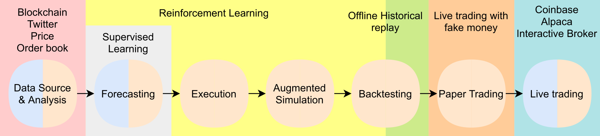
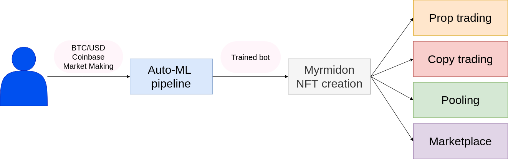

##  Introduction 
It is time for small investors and retail traders to leverage the state-of-the-art technology used in hedge funds. We offer a no-code platform for [automatic trading system](https://en.wikipedia.org/wiki/Automated_trading_system) (ATS) designed with the algorithms used in most recent breakthroughs in AI ([GO](https://deepmind.com/research/case-studies/alphago-the-story-so-far), [DotA 2](https://openai.com/five/), [Starcraft II](https://deepmind.com/blog/article/AlphaStar-Grandmaster-level-in-StarCraft-II-using-multi-agent-reinforcement-learning) etc). We tackle the [cryptocurrencies](https://en.wikipedia.org/wiki/Cryptocurrency) challenge.
Usually, such strategies are manually designed by experts with a set of intricate rules. Our technology, based on [Reinforcement Learning](http://incompleteideas.net/book/the-book.html) (RL) - a subset of [Machine Learning](https://en.wikipedia.org/wiki/Machine_learning) (ML) - derives those rules optimally from data with zero effort. Our platform facilitates the training and testing of the bots (_or agents_) in unknown conditions, certifying its performances, and because trading is not about creating a one-fits-all strategy, the user can also monitor and update his bots. Finally, the user can sell his bots or even scale his earnings using [copy trading](https://en.wikipedia.org/wiki/Copy_trading), or [pooling](https://www.investopedia.com/terms/p/pooledfunds.asp).

## Team 

We are engineers by training. 

 

Nicolas Carrara is a postdoctoral researcher at the University of Toronto specialized in real life application of RL, including dialogue systems, autonomous driving, and traffic signal control. He is also specialized in transfer learning, safe RL, and multi-agents RL (MARL). He has published at international conferences including [NeurIPS](https://papers.nips.cc/paper/2019/hash/4fe5149039b52765bde64beb9f674940-Abstract.html) and [UAI](https://sites.google.com/view/rl-uai2018/schedule?authuser=0). He did several collaborations with industry including Google, Microsoft and Huawei.
 

 

Bachir Arif is tech lead at the Société Générale. Through his career, he has built a network of finance professionals including traders, portfolio managers and quants. At [LIST](https://www.list.lu/) he did research on [blockchains](https://en.wikipedia.org/wiki/Blockchain), especially in crypto-currencies. While being at Deloitte, he developed multiples [decentralized applications](https://en.wikipedia.org/wiki/Decentralized_application) (Dapp).

We both bring to the company a combination of cutting edge technologies and domain expertise in order to design the perfect fintech product, with an extremely high barrier of entry (ML and blockchain).
  
## The problems

We have identified three main problems in the retail trading space. 

### Trading is hard
The majority of people is [losing money trading](https://markets.businessinsider.com/news/stocks/if-you-re-day-trading-you-will-probably-lose-money-here-s-why-1030667770) (more than 80% on the forex). The reason is simple, unlike investing, trading is almost a zero-sum game, meaning if someone makes 5 dollars, another one loses 5 dollars. On this game, individuals have no edge against investment banks and hedge funds. Individuals usually trade manually, are subject to their own emotions, and it is a repetitive task. The trading frequency is also very slow. A lot of competitors offer automation solutions to design one's own trading strategy, but creating a trading strategy is hard, even assuming oracle-like directional information like "the price is going to go up". When it is going to go up? How certain are we? What if there is a network delay when placing a BUY order? What if other market participants are adapting to my order and take advantage of it? What if the market is being manipulated right now ? All those questions can not be answered with classical ML. Most advanced hedge funds usually rely on ML models predicting the price, sometimes the volume, this is called [forecasting](https://www.investopedia.com/terms/f/forecasting.asp); but they do not create automatically a trading strategy given this information, also called [execution](https://www.investopedia.com/terms/e/execution.asp). It is usually the role of the trader, or the quant-trader, to find the trading strategy by combining a set of different indicators, ML models, and "if-then-else" rules. This is where RL shines, it can find the optimal actions to take in a given context, using past information, and anticipating the future, for optimal returns, solely using data. Simply put, RL will find the rules automatically, faster, and better than an expert.

### It is a never ending process

If your trading strategy was optimal yesterday, it might be not the case today. Market adapts, it evolves, or more precisely, market participants update their strategies. To keep up, financial institutions hires hundreds of traders and quants to update theirs models on a regular basis. In the meantime, retail trades usually have a single strategy, never updated. Hence, it is impossible to compete. By nature, Reinforcement Learning solves this problem. Indeed, the more data the trading agent ingests, the more up to date and optimal is the strategy.

### Nobody trusts trading bots

In order to generate passive income, retail investors might be tempted to buy or rent a trading bot, or follow a trader on Telegram or Discord. It is simply impossible to discriminate between scams and legit services. In the telegram space, it is not uncommon that  influencer traders encourage their followers to buy a particular stock for their own profit (see pump and dump). The bot market is saturated with offer promising high yield and unrealistic performances. Those bots might perform worse than the S&P500. This fallacy is particularly true in the crypto market, where the bullish trend (meaning the currency value is mostly increasing) gives the illusion that all strategies perform well. Trading is about [_alpha_](https://www.investopedia.com/terms/a/alpha.asp), meaning how much better the strategy performs against the overall market. At Myrill.io, we intend to certify bots' _alpha_ and bots' origin using blockchain-related technologies.

## The solution

We provide a no-code tool for ATS creation and certification. It is a platform based upon a modular pipeline. 

### Auto-ML for trading

The pipeline includes several modules, each of them can be customized, see the figure below:

1. Data source and analysis. Can include third party alternative data (satellite images, twitter ...). We also extract "on-chain" data, meaning public data available on crypto-currencies blockchains.
2. Forecasting with supervised learning. Can include third party buying/selling signals.
3. Execution with RL.
4. Augmented simulation using self-play.
5. Back-testing, paper trading and live trading.

Existing solutions in most recent fintech trading startups (including Y-Combinator backed startups) usually provides 1 and 5. The module 2 and 3 must be designed by hand using a set of rules and indicators. Some specialized companies provide 2, and we intend to integrate their services and offer our own. Nobody provides 3 and 4 as far as we know. Some companies offer black-box bots services, but are rule-based strategies under the hood (hence non-optimal). 

Our architecture supports market-making (providing liquidity, i.e. enough instruments to be sold or bought on an exchange), arbitrage (buy 5 BTC on Binance and sell 5 BTC on Coinbase) and directional (price is going up, I buy).

### Blockchain certification

Once a bot has been designed and trained, we associate a [Non-Fungible Token](https://en.wikipedia.org/wiki/Non-fungible_token) (NFT) to it. We call it [Myrmidon](https://en.wikipedia.org/wiki/Myrmidons). We develop a Dapp to manage and store it. The Dapp interacts with the [Solana](https://solana.com/) blockchain, and we are working exclusively with the smart contracts to guarantee verified data. The NFT certifies several properties of the bot: 

- Ownership. The NFT is linked to the public address of the creator and can be sold on Myrill's marketplace. 
- Statistical Model and meta-parameters checksum. The data itself is stored on Solana and thus cannot be modified any longer.
- Performances. We record on the blockchain simulation performances, and the bot's trades during live trading.

This certification mechanism unlocks a market for true and unaltered trading bots. This way, users can rent, buy, or invest into myrmidons without having to worry about scam and performance issues.

## User story

Myrill is an ML as a service (MLaaS). User interact with a web interface or a mobile app in order to design, train and evaluate a trading bot. The figure bellow shows each step of the user story: 

It goes as follow:
1. First, the user construct a bot graph (using no-code or SDK), specifying preferences (instrument, exchange, behavior, risk, data ...) and for more advanced user, meta-parameters (learning rate, gamma ...).
2. Then we compile the graph to create the bot, and the bot is trained in simulation.
3. Then a Myrmidon NFT is linked to the bot.
4. Finally, the user is given four options:
   - Prop trading: use his bot to generate passive income.
   - Copy trading: generate income for his bot and extra income from copycat traders.
   - Pooling: use his bot to trade with the funds of other users.
   - Marketplace: sell his bot on the Myrill's marketplace (powered by Metaplex).

## About the 100 myrmidons pre sale

We are selling 100 myrmidons NFT, 10 each week from October to January. Each myrmidon unlocks several perks:
- unique access to a pre-configured and pre-trained bot.
- early access to the no-code platform.
- access to the restricted slack with direct support from ML engineers, quants and traders. Note that a public discord is available at [this url](https://myrill.io/discord-link).

Each myrmidon has a unique investor profile. Some will trade only on Coinbase, some will use alternative data, some will do market making etc. Myrmidon#1 will be the first to be available for live trading in June 2022, then others will be release each month from June 2022 to May 2023.

The marketplace is available at this url.
